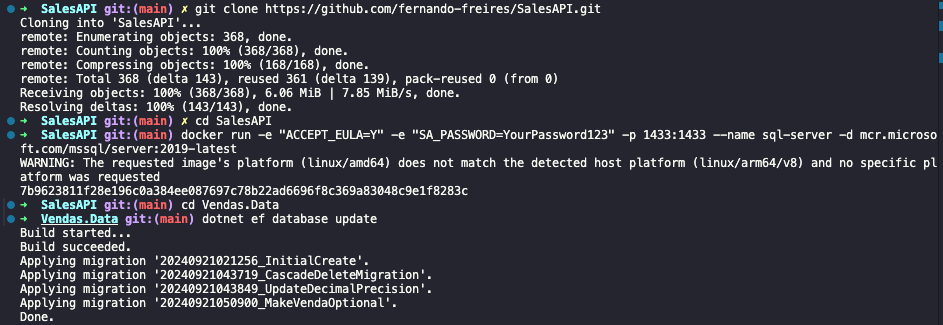
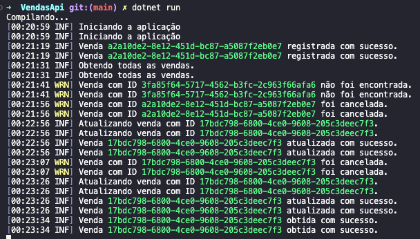

# Vendas API

---

## Descrição

Uma API para gestão de vendas que inclui operações CRUD completas, implementada utilizando .NET Core 6, com princípios de Domain-Driven Design (DDD), SOLID, DRY, e YAGNI. A API também faz uso de logging com Serilog e está coberta por testes de unidade utilizando XUnit, FluentAssertions, Bogus e NSubstitute.

---

## Ferramentas e Versões Utilizadas

- **.NET Core**: 6.0
- **Entity Framework Core**: 6.0
- **SQL Server**: 2019
- **Serilog**: 2.10.0
- **XUnit**: 2.4.1
- **FluentAssertions**: 6.12.1
- **Bogus**: 35.6.1
- **NSubstitute**: 5.1.0

---

## Pré-requisitos

- **.NET 6 SDK** instalado
- **Docker** (ou uma instalação do **SQL Server 2019** local)
- **Git** para clonar o repositório

---

## Instalação e Execução

### 1. Clone o repositório:

```bash
git clone https://github.com/fernando-freires/SalesAPI.git
cd SalesAPI
```

### 2. Configurando o banco de dados:

```bash
docker run -e "ACCEPT_EULA=Y" -e "SA_PASSWORD=YourPassword123" -p 1433:1433 --name sql-server -d mcr.microsoft.com/mssql/server:2019-latest
```

### 3. Atualize a string de conexão

Abra o arquivo appsettings.json e atualize a string de conexão conforme seu ambiente:

```bash
"ConnectionStrings": {
  "DefaultConnection": "Server=localhost,1433;Database=VendasDB;User Id=sa;Password=YourPassword123;"
}
```

Vendas.Data.Context/DbContextFactory.cs também possui a string de conexão, verificar caso seja necessário alterar o acesso

```bash
optionsBuilder.UseSqlServer("Server=localhost,1433;Database=VendasDB;User Id=sa;Password=YourPassword123;
```

### 4. Execute as migrações:

```bash
cd Vendas.Data
dotnet ef database update
```

### 5. Execute a API:

```bash
cd ../VendasApi
dotnet run
```

### 6. Acesse a documentação (Swagger):

```bash
http://localhost:5057/swagger/index.html
```

### 7. Demonstração no terminal:

Na imagem abaixo mostra o processo seguindo o passo a passo do README até chegar nas migrations do banco de dados


### 8. Logs da aplicação:

Após finalizar as migrations e executar o comando cd ../VendasApi para ir ao diretório da API de fato, será inicializada a aplicação logo depois de executar o comando dotnet run. Segue a imagem demonstrando


### O fluxo na imagem acima foi o seguinte:

- Iniciei a aplicação
- **(POST)** Registrei uma nova venda seguindo o payload padrão no Swagger
- **(GET)** Consultei todas as vendas para verificar se a venda que criei havia sido registrada
- **(GET/ID)** Tentei aplicar um `getById` passando um ID diferente e obtive o log informando que a venda não foi encontrada
- **(GET/ID)** Passei o ID correto, porém a venda foi criada com o campo `"cancelada": true`, então ela não foi retornada
- **(PUT)** Atualizei a venda alterando o campo `"cancelada": "false"`
- **(GET/ID)** Após atualizar a venda, fiz um `getById` novamente e consegui obter a venda corretamente

## Testes

### 1. Entre no diretório Vendas.Tests e execute o seguinte comando:

```bash
dotnet test
```
